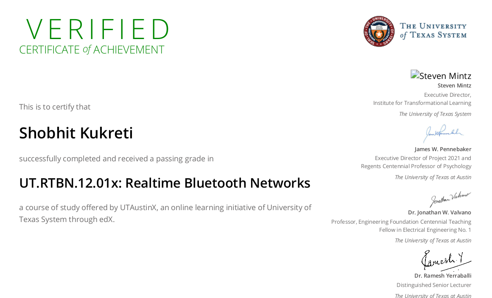

## Real Time Bluetooth Network 
### UTAustinX -  UT.RTBN.12.01x Dec 2016

#### Topics:

1. Introduction to RTOS
2. Thread Management
3. Time Management
4. Real Time Systems
5. File Systems
6. Bluetooth Low Energy

#### Lab Hardware

1. LaunchPad: EK-TM4C123GXL
2. MK-II I/O booster: BOOSTXL-EDUMKII
3. CC2650 Bluetooth module: BOOSTXL-CC2650MA or LAUNCHXL-CC2650

##### Course Content
https://www.edx.org/course/real-time-bluetooth-networks-shape-the-world

### Certificate

